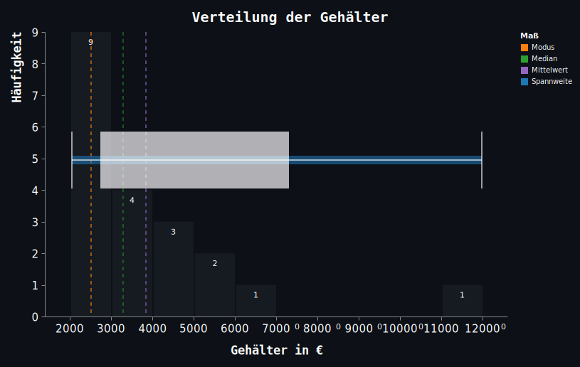

# Statistik
 
  > Es sollen damit die Berechnung grundlegender statistischer Maße wie Mittelwert, Median, Modus, Spannweite, Varianz und Standardabweichung gezeigt werden.  

## Gehaltsdaten

| Mitarbeiter | Gehalt [€] | | Mitarbeiter | Gehalt [€] | | Mitarbeiter | Gehalt [€] |  
| :---------: | :--------: |-| :---------: | :--------: |-| :---------: | :--------: |  
| MA_1        | 2000       | | MA_8        | 2700       | | MA_15       | 4200       |  
| MA_2        | 2100       | | MA_9        | 2800       | | MA_16       | 4500       |  
| MA_3        | 2200       | | MA_10       | 3000       | | MA_17       | 5000       |  
| MA_4        | 2300       | | MA_11       | 3500       | | MA_18       | 5500       |  
| MA_5        | 2400       | | MA_12       | 3600       | | MA_19       | 6000       |  
| MA_6        | 2500       | | MA_13       | 3800       | | MA_20       | 12000      |  
| MA_7        | 2600       | | MA_14       | 4000       | |             -            |

--- 

# Interpretation der statistischen Maße

## Mittelwert (Durchschnitt)

- ### Er zeigt den durchschnittlichen Verdienst in diesem Unternehmen.  
  > Der Mittelwert wird stark von Ausreißern beeinflusst.

    $$\underline{Mittelwert = \frac{\sum x_i}n}$$
 
    $$\scriptsize{\sum x_i = Summe\ aller\ Gehälter}\ \ \ n = Anzahl\ der\ Personen\ im\ Datensatz$$

  - ### *1. )* Summe aller Gehälter: $\ \ \scriptsize{ 2000+2200+...+12000 = 77000\ EUR} $

  - ### *2. )* Anzahl der Personen:  $\ \ \scriptsize n = 20 $

  - ### *3. )* Mittelwert berechnen: $\ \ Mittelwert = \frac{77000}2 = \underline{3850\ EUR} $

   

--- 

  

## Median

  - ### Er **teilt den Datensatz in zwei Hälften**:  
    > Die eine Hälfte der Mitarbeiter verdient weniger, die andere mehr.  
  
    *Der Median ist robuster gegenüber Ausreißern als der Mittelwert.*

    - ### *1. )* Datensatz **sortieren**  
    - ### *2. )* **Anzahl** der Werte feststellen  
    - ### *3. )* **Mittleren Werte** sind an Stelle 10 und 11  
  
 

  $$Median = \frac{3000+3500}2 = \underline{3250\ EUR}$$ 

 

---

## Modus

- ### Der Modus **zeigt den häufigsten Wert**.

  *Eine Clusterung in Bereiche kann Sinn machen.*

  *Der Modus ist nützlich für kategorische Daten*
  > z.B. häufige Antworten bei Umfragen.

   
  
   - ### *1. )* **Zählen** der **Häufigkeit** jedes Wertes.
   - ### *2. )* Der am **häufigsten vorkommende Wert** ist der **Modus**.
  
   
 
    $$\underline{Der\ Wert\ 2500\ EUR\ kommt\ 2\ mal\ vor.}$$
 
   

---

  

## Spannweite

- ### Sie gibt an, wie groß der **Unterschied** zwischen dem **höchsten und niedrigsten Wert** ist.  

  > *Die Spannweite ist ein sehr einfaches **Maß für die Streuung**.*

$$ \underline{Spannweite = max_{(x_i)} - min_{(x_i)}} $$
$$ max_{(x_i)} = der\ größte\ Wert\ im\ Datensatz $$  

$$ min_{(x_i)} = der\ kleinste\ Wert\ im\ Datensatz $$

$$ Maximalwert \ (höchstes\ Gehalt)  = \underline{12\ 000\ EUR} $$

$$ Minimalwert \ (niedrigstes\ Gehalt) = \underline{2\ 000\ EUR} $$
$$ Spannweite  = 12\ 000 - 2\ 000 = \underline{10\ 000\ EUR} $$

---

## Varianz

- ### Sie misst die **durchschnittliche quadratische Abweichung** vom Mittelwert.

  $$\underline{Varianz = \frac{1}n \sum_{i=1}^{n}{(x_i-\bar{x})^2}}$$

   

    - ### *1. )* ***Mittelwert*** berechnen
    - ### *2. )* **Abweichung jedes Wertes** zum Mittelwert berechnen
    - ### *3. )* Abweichungen **quadrieren** *(damit werden sie positiv)*
    - ### *4. )* **Summe** bilden
    - ### *5. )* **Durch** die **Anzahl** der Werte **dividieren**

   

---

  

  ## Standardabweichung

  - ### Die Standardabweichung misst die **durchschnittliche Abweichung der Werte vom Mittelwert**.  

    *Sie zeigt an, wie stark die einzelnen Werte um den Mittelwert **streuen**.*  

    > - Je größer die Standardabweichung, desto weiter liegen die Werte   auseinander.  
    > - Eine kleine Standardabweichung bedeutet, dass die Werte eng um den  Mittelwert gruppiert sind.  

  $$\underline{Standardabweichung = \sqrt{\frac{1}n \sum_{i=1}^{n}{(x_i-\bar{x})^2}}}$$

---

## Statistische Maße

   | Mittelwert             | 3840    EUR     |
  | :-----------------     | :---------:     |
  | **Median**             | **3250    EUR** |
  | **Modus**              | **2500    EUR** |
  | **Spannweite**         | **10000   EUR** |
  | **Varianz**            | **5042526 EUR** |
  | **Standardabweichung** | **2245    EUR** |

 

 ## Diagramm

 

   

  

